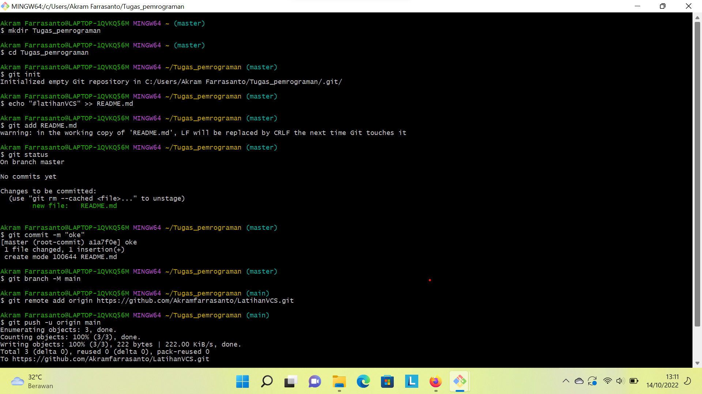

# CARA PENGGUNAAN GIT

## Instalasi GIT

#### - Dowload GIT, buka website resminya Git (git-scm.com).
#### - Kemudian unduh Git sesuai dengan arsitektur komputer kita. Kalau menggunakan 64bit, unduh yang 64bit. Begitu juga kalau menggunakan 32bit.
#### - Selamat, Git sudah terinstal di Windows. Untuk mencobanya, silahkan buka CMD atau PowerShell, kemudian ketik perintah
```
git --version
```


#### - Pada saat pertama kali menggunakan git, perlu dilakukan, konfigurasi "user_name" dan "user.email"
#### - Konfigurasi ini bisa dilakukan untuk global repository atau individual repository
#### - Apabila belum dilakukan konfigurasi, akan mengakibatkan terjadi kegagalan saat menjalankan print global git commit


#### - Config Global Repository
```
$ git config -- global user.name "nama_user"
```
```
$ git config -- global user.mail"nama_user"
```

## Perintah Dasar Git

#### - Git init, perintah untuk membuat repository lokal.
#### - Git add, perintah untuk menambah file baru,atau perubahan pada file pada staging sebelum proses commit. 
#### - Git commit, perintah untuk menyimpan perubahan kedalam database git.
#### - Git push -u origin master, perintah untuk mengirim perubahan pada repository lokal menuju server repository.
#### - Git clone [url], perintah untuk membuat working directory yang diambil dari repository server.
#### - Git remote add origin [url], perintah untuk menambahkan remote server/repository server pada lokal repository (working directory).
#### - Git pull, perintah untuk mengambil/mendowload perubahan terbaru dari server repository ke lokal repository.

## Membuat Repository Lokal

#### - Buka directory aktif misal: C:\User\Desktop\dlabs_pemograman1 (buka menggunakan Windows Explorer).
#### - Klik kanan pada directory aktif tersebut, dan pilih menu Git Bash. Sehingga muncul git bash command.
#### - Buat directory project pratikum pertama dengan nama Latiha1
```
$ mkdir latihan1
```
$ cd Latihan1
```

#### - Sehingga terbentuk suatu directory baru dibawahnya, selanjutnya masuk kedalam directory tersebut dengan perintah cd (change directory).
#### - Directory aktif menjadi: C:\User\Desktop\dlabs_pemograman1\Latihan1

## Membuat Repository Lokal 

#### - Jalankan perintah git init, untuk membuat repository lokal.
```
$ git init
```

#### - Repository baru berhasil di inisialisasi, dengan terbentuknya satu directory hidden dengan nama .git
#### - Pada directory tersebut, semua perubahan pada working directory akan disimpan.


