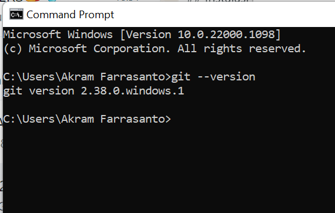

# CARA PENGGUNAAN GIT

## Instalasi GIT

#### - Dowload GIT, buka website resminya Git (git-scm.com).
#### - Kemudian unduh Git sesuai dengan arsitektur komputer kita. Kalau menggunakan 64bit, unduh yang 64bit. Begitu juga kalau menggunakan 32bit.
#### - Selamat, Git sudah terinstal di Windows. Untuk mencobanya, silahkan buka CMD atau PowerShell, kemudian ketik perintah
```
git --version
```


#### - Pada saat pertama kali menggunakan git, perlu dilakukan, konfigurasi "user_name" dan "user.email"
#### - Konfigurasi ini bisa dilakukan untuk global repository atau individual repository
#### - Apabila belum dilakukan konfigurasi, akan mengakibatkan terjadi kegagalan saat menjalankan print global git commit
#### - Config Global Repository
```
$ git config -- global user.name "nama_user"
```
```
$ git config -- global user.mail"nama_user"
```

## Perintah Dasar Git

#### - Git init, perintah untuk membuat repository lokal.
#### - Git add, perintah untuk menambah file baru,atau perubahan pada file pada staging sebelum proses commit. 
#### - Git commit, perintah untuk menyimpan perubahan kedalam database git.
#### - Git push -u origin master, perintah untuk mengirim perubahan pada repository lokal menuju server repository.
#### - Git clone [url], perintah untuk membuat working directory yang diambil dari repository server.
#### - Git remote add origin [url], perintah untuk menambahkan remote server/repository server pada lokal repository (working directory).
#### - Git pull, perintah untuk mengambil/mendowload perubahan terbaru dari server repository ke lokal repository.

## Membuat Repository Lokal

#### - Buka directory aktif misal: C:\User\Desktop\dlabs_pemograman1 (buka menggunakan Windows Explorer).
#### - Klik kanan pada directory aktif tersebut, dan pilih menu Git Bash. Sehingga muncul git bash command.
#### - Buat directory project pratikum pertama dengan nama Latiha1
```
$ mkdir latihan1
```
```
$ cd Latihan1
```
#### - Sehingga terbentuk suatu directory baru dibawahnya, selanjutnya masuk kedalam directory tersebut dengan perintah cd (change directory).
#### - Directory aktif menjadi: C:\User\Desktop\dlabs_pemograman1\Latihan1

## Membuat Repository Lokal 

#### - Jalankan perintah git init, untuk membuat repository lokal.
```
$ git init
```
#### - Repository baru berhasil di inisialisasi, dengan terbentuknya satu directory hidden dengan nama .git
#### - Pada directory tersebut, semua perubahan pada working directory akan disimpan.

## Menambahkan File Baru pada Repository

#### - Untuk menambahkan file dapat menggunakan _text editor_, lalu menyimpan filenya pada directory aktif (repository).
#### - Disini kita akan coba buat satu file bernama README.md (text file).
```
$ echo "#latihan1" >> README.md
```
#### - File README.md berhasil dibuat.

#### - Untuk menambahkan file yang baru saja dibuat tersebut gunakan perintah git add.
```
$ git add README.md
```
#### - File README.md berhasil ditambahkan.


## Commit (Menyimpan Perubahan ke Database)

#### - Untuk menyimpan perubahan yang ada kedalam databse repository lokal, gunakan perintah git commit -m "komentar commit".
#### - Perubahann berhasil disimpan.


## Membuat Reposity Server

#### - Server repository yang akan kita gunakan adalah http://github.com
#### - Anda harus membuat akun terlebih dahulu.
#### - Pada laman github, klik tombol start a project, atau 
####   dari menu (icon +) klik New Repository.


#### - Isi nama repositorynya, misal: labpy.
#### - Lalu klik tombol Create repository.


## Menambahkan Remote Repository

#### - Remote Repository merupakan repository server yang akan digunakan untuk menyimpan setiap perubahan pada lokal repository, sehingga dapat diakses oleh banya user.
#### - Untuk menambahkan remote repository server, gunakanlah perintah
####  Git remote add origin [url]
```
$ git remote add https://github.com/Akramfarrasanto/lappy1.git
```

## Push ( Mengirim Perubahan ke Server)

#### - Untuk mengirim perubahan pada lokal repostiory ke server gunakan perintah git push.
```
$ git push -u origin master
```
#### - Perintah ini akan meminta memasukkan _username_ dan _password_ pada akun anda di github.com


## Melihat Hasilnya pada Server Repository

#### - Buka laman github.com, arahkan pada repositorynya.
#### - Maka perubahan akan terlihat pada laman tersebut.


## Clone Repository

#### - Clone repository, pada dasarya adalah meng-copy repository server dan secara otomatis membuat satu directory sesuai dengan nama repositorynya (working directory).
#### - Untuk melakukan cloning, gunakan perintah git clone [url]
```
$ git clone [https://git hub.com/Akramfarrasanto/labpy1.git)
```


## Kegunaan File README.md

#### - Apabila kita menggunakan github, untuk memberikan penjelasan awal pada project yang kita buat, maka dapat menggunakan sebuah file yang bernama README.md.
#### - Pada file tersebut kita dapat membuat dokumentasi awal dari setiap project yang kita buat untuk memberikan penjelasan atau sekedar cara peggunaan dari aplikasi yang kita kembangkan.
#### - Penulisan file README.md berbasis teks, dan untuk pemformatannya menggunakan Markdown format.
#### - Untuk lebih jelasnya, dapat anda pelajari cara penggunaannya markdown pada url berikut: https://guides.github.com/features/mastering-markdown/
